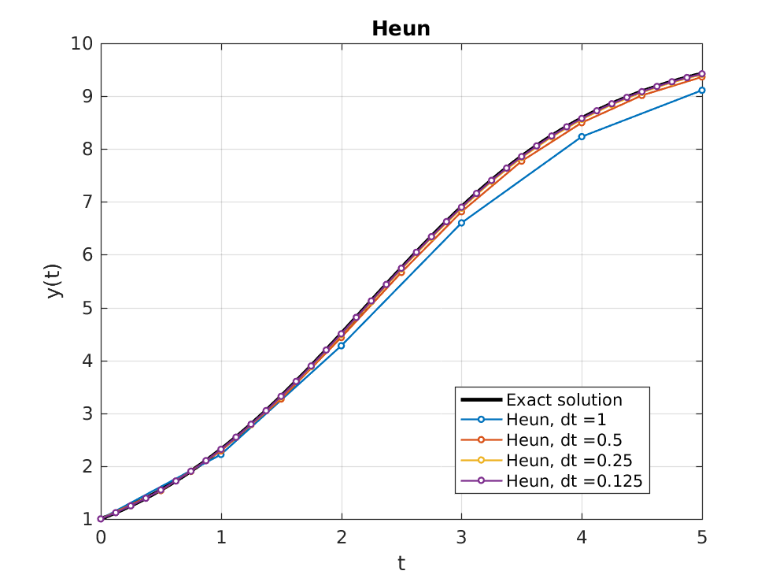
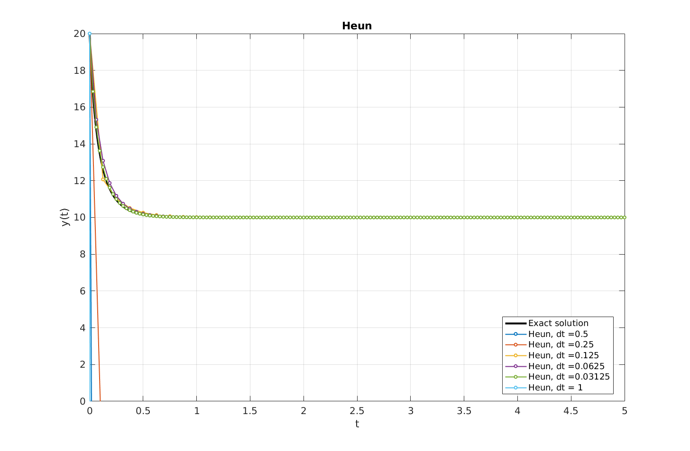

# sc-lab

## Implemented
* **discrete processes**
* **numerical methods for ODEs**:
  * explicit Euler
  * method of Heun
  * Runge-Kutta (4th order)
  * implicit Euler
  * Adams-Moulton (2nd order)
  * Newton's method
* **numerical methods for PDEs**:
  * Gauss-Seidel method
  * boundary value problems (stationary)
  * boundary and initial value problems (instationary)
  * explicit and implicit methods
  
## Examples

  
  
  

---

  
  
  
  

---

  

---

  

